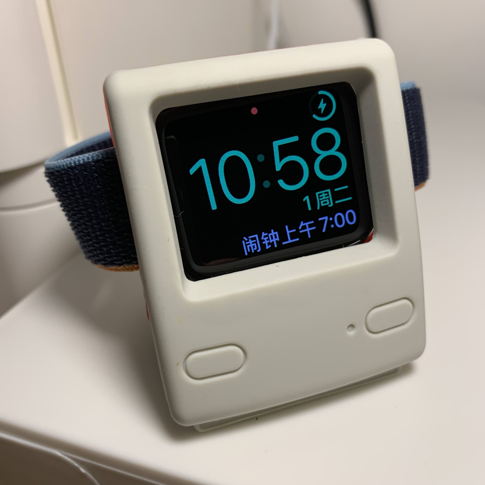
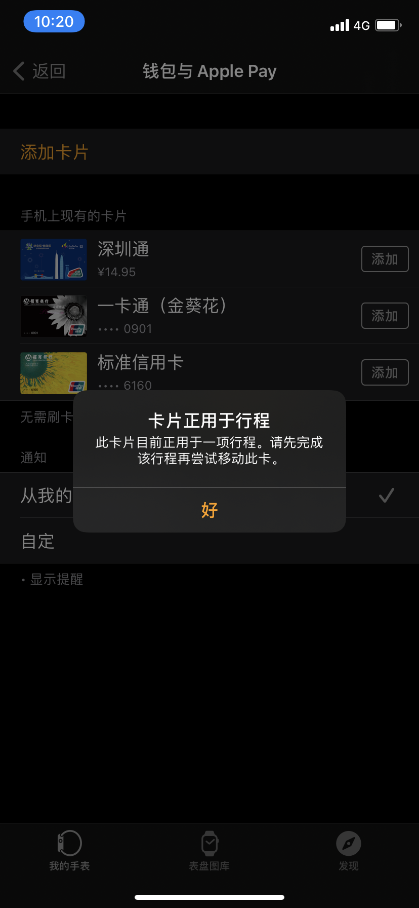
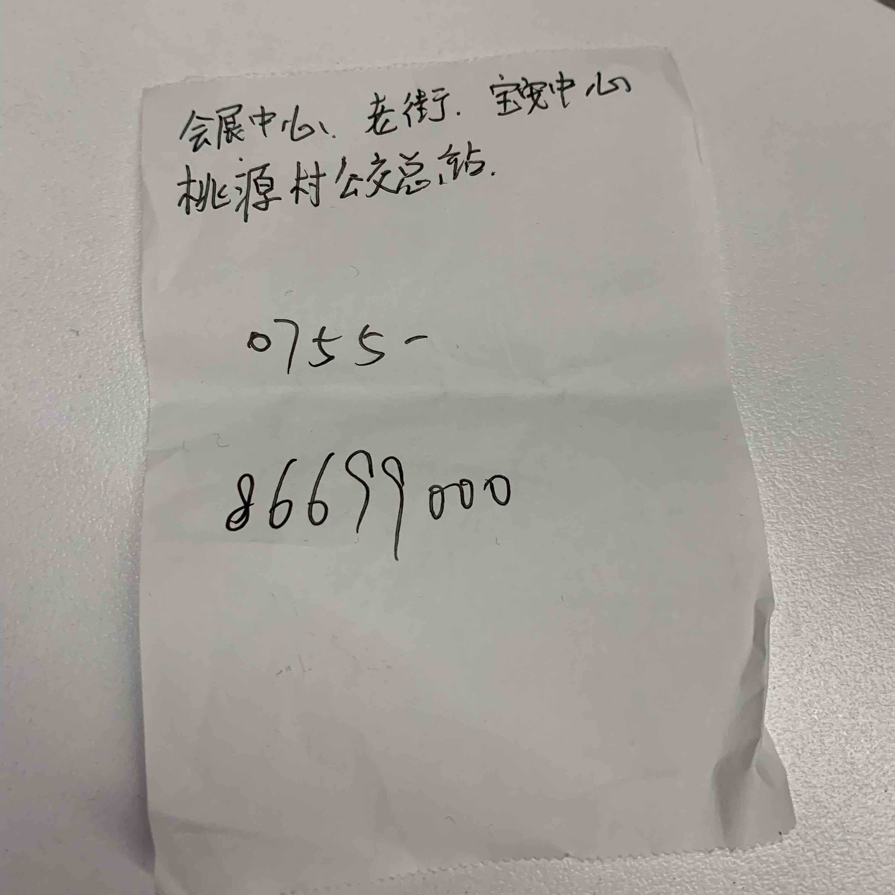
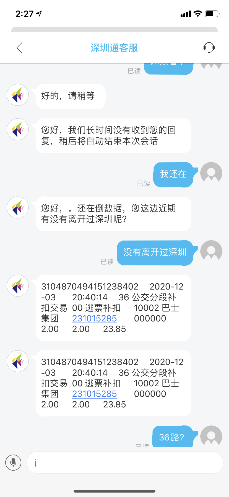
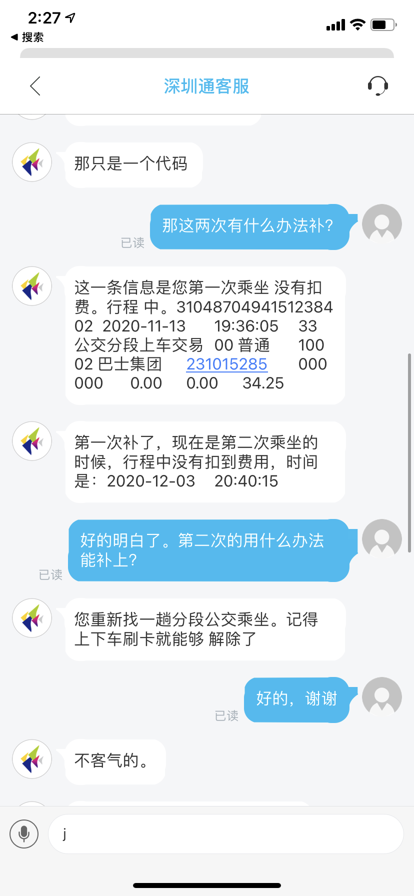
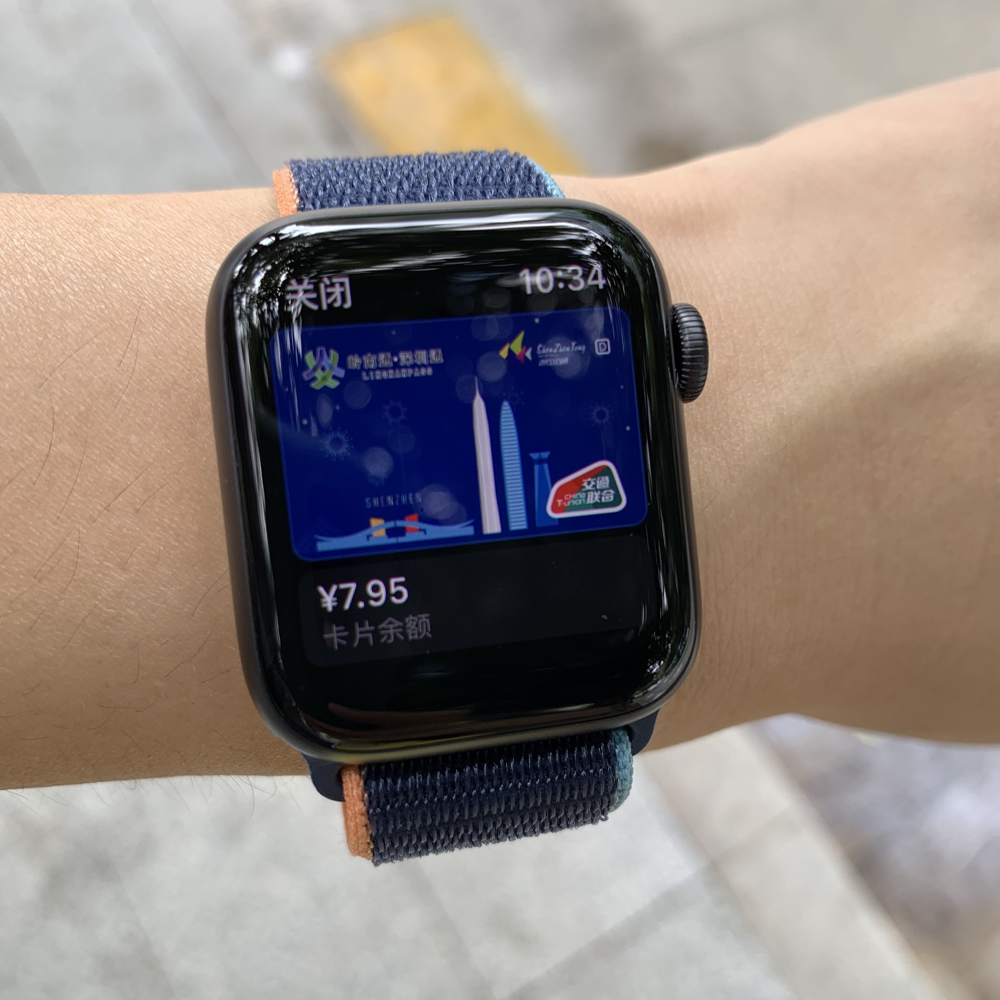

## 我买了 Apple Watch！

自己虽有一块佩戴多年的机械手表，这也是我一直不太需要 Apple Watch 的原因。自从去年秋天开始跑步，近期开始学习力量训练，感觉小米手环没那么好用了。做了几天的功课，决定买一款蜂窝版，有血氧检测功能的 Apple Watch，上个月中在深圳益田的 Apple Store 购买了人生第一块 Apple Watch。

开始戴上的一段时间，一切都觉得哇哦！真棒！漂亮的表盘，完美的震动反馈，毫无感知的与手机无缝同步健康数据。算得上我购买最具辛福感的数码设备。特意买了一个充电底座给手表。

## 尝试添加公交卡到 Apple Watch

刚开始花了不少时间玩表盘，玩腻了。就开始尝试各种功能，当我尝试把手机钱包的深圳通添加到手表时，被提示"卡片正用于行程中"：

字面意思理解，应该是我的某次行程没刷到卡，这种情况似曾相似，以前用实体的深圳通卡，无法出站进站，都需要去售票窗口处理。于是打算下一次乘坐地铁去售票的窗口咨询一下。一晃快一个月过去了，说什么不能再拖了，上周就打算坐地铁上班，跑去售票窗口查了一下，并没有未完成的行程记录，我不死心，跑了两个站的窗口都是同样的答复，第二次在西丽站，窗口的工作人员看我不甘心，建议我去深圳通的服务网点处理，特地写了一张字条给我。

我当时有点崩不住了，这一趟趟跑那么远，还不一定能解决我的问题。于是我开始打客服电话，打了两遍都只有自动语音服务，根本没有人工接听。灰溜溜的回赶回公司上班。

## 寻找解决的办法

回到公司，我开始琢磨怎么才能跟深圳通的客服联系上，至少我想确认下问题是什么，尽可能保证自己不会白跑一趟网点。在iPhone钱包的深圳通卡、点更多按钮，可以找到了深圳通的官方 APP，下载后在 APP 内有在线客服，经过跟客服的一番咨询，总算搞清楚我的未完成的行程是哪一天欠费的，我曾乘坐的公交线路确实有未完成形成。

## 为什么会有未完成的行程呢？

因为深圳分段收费公交车线路，都是人工售票的，上车后告诉售票员去哪里，售票员会在扣费的机器上输入票价再刷卡扣费。而我在去年某一次乘坐了一种无人售票分段收费的线路，需要在上车时刷卡，下车时再次刷卡扣费，我是真没坐过这种线路，下车就直接走了没刷卡。于是就只有这次乘坐的上车记录，缺少下车刷卡的记录来完结行程。客服告诉我，需要我自己去找一条这样线路的公交车再乘坐一次，我半信半疑，问题是！！！我不知道去查深圳的无人售票的分段线路呢，客服说也不知道。

## 如何补回行程欠费？

为了找到无人售票的分段收费线路，我找到了[深圳巴士集团的网站](http://www.szbus.com.cn/intro/11.html)，通过上面的客服电话，咨询到东部巴士集团公司目前全市只有 3 条线路是这种无人售票分段收费的，而有一条 316 是我曾经坐过的线路，查了一下 316 的站点，我去年确实乘坐过这路车去看 Live House。

## 完成！乘坐一次 316 补回行程

查到线路后，今天上午坐地铁上班转线到 316 站点，等了 20 多分钟，下车时刷完卡，马上打卡开手机，终于可以把深圳通从 iPhone 添加到 Apple Watch 了。经过一番折腾历时一个月，总算可以用 Apple Watch 刷公交卡了！

等等！！！

为什么深圳通添加到手表后，手机的钱包没有了公交卡？又是网上一番搜索，原来公交卡只能绑定一个设备，无法想信用卡一样可以同时在手机和手表上支付。我思来想去，还是手机刷公交卡方便，毕竟我左手佩戴手表，在右手边刷卡进站，也怪怪的！

于是，我又把深圳通从手表上放回手机钱包里。